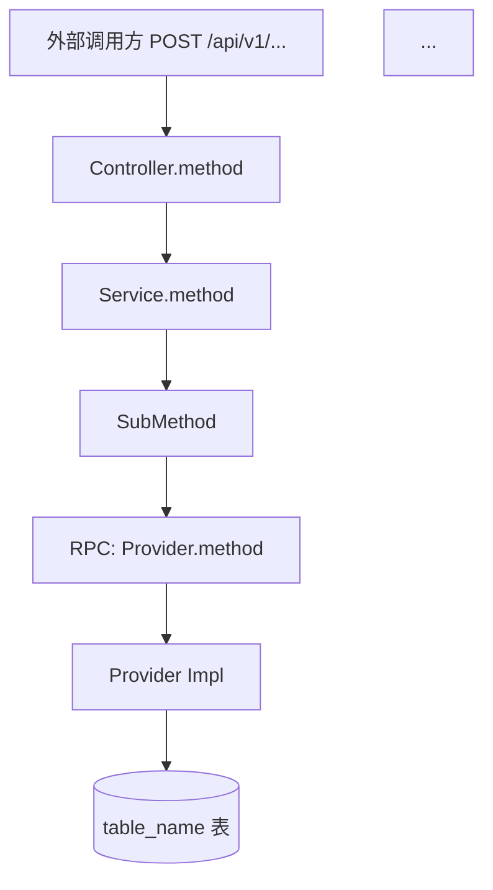
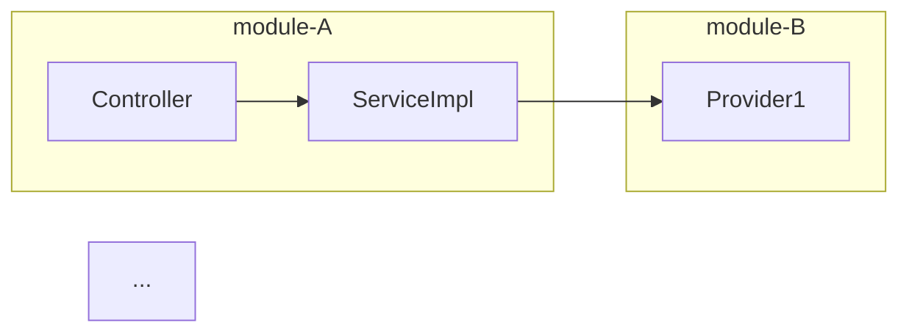

# 报告模板（通用版）

把 subagent 报告 + inline 读到的代码融合成最终 Markdown 时，按以下结构组织。本模板与具体项目无关，按需替换占位符。

---

## Frontmatter

```yaml
---
日期: {YYYY-MM-DD}
tags:
  - {your-tag}
aliases: {NNN}.{原文件名}-接口流程分析
ReleaseTime: {YYYY-MM-DD}
BranchName:
SessionName: {NNN}.{日期}.{原文件名}-接口流程分析

---
```

---

## 标题 + 摘要

```markdown
# {NNN}.{日期}.{原文件名}-接口流程分析

> 本文档对 `POST {URL}` 接口以及同 Controller 的 N 个接口进行全量调用链分析，覆盖 Controller → Service → 多个 RPC Provider → Service → Mapper → DB 的完整路径，以及触发的 MQ 异步链路。
>
> **关键事实（已验证代码）**：
> 1. {关键事实 1}
> 2. {关键事实 2}
> 3. {关键事实 3}
```

---

## 1. 接口清单

如果 Controller 包含多个接口，每个都列出：

| 方法 | 路径 | 方法签名 | 说明 |
|---|---|---|---|
| POST | `/sync` | `labelSync(SyncRequest)` | **本次分析重点** |
| POST | `/delete` | `labelDelete(DeleteRequest)` | ... |

---

## 2. 主调用链流程图（Mermaid）

**必须**画一个完整的 flowchart TD 覆盖所有关键节点：



---

## 3. 详细步骤分解

每个步骤单独一节：

```markdown
#### 步骤 N — 标题

`Service.method`（line 155-168）：
- 做什么
- 关键参数
- 调用了哪些 RPC / SQL

> ⚠️ **MQ 状态**：当前是否发 MQ（是/否 + 引用代码注释证据）
```

---

## 4. 其他相关接口流程图

Controller 中的每个接口一个流程图。

---

## 5. 跨模块调用关系图



---

## 6. 各 RPC Provider 落点对照表

| RPC Provider | 所在模块 | 实现类 | Service | Mapper | 目标表 | XML 路径 |
|---|---|---|---|---|---|---|
| `Provider1Service` | `module-B/xxx-provider` | `Provider1` (`@DubboService` 或对应注解) | `Service1` | `Mapper1` (config) | **`table_1`** | `mapper/config/Mapper1.xml` |
| ... | ... | ... | ... | ... | ... | ... |

> **注**：分片表的 Service 继承 `ShardingBaseServiceImpl`（按 `corp_id` 路由），非分片表的 Service 继承 `BaseServiceImpl`。

---

## 7. 关键代码位置索引

| 关注点 | 文件 | 关键行 / 方法 |
|---|---|---|
| 入口 Controller | `module/.../Controller.java` | `methodName` line 43-49 |
| Service 主流程 | `module/.../ServiceImpl.java` | `methodName` line 155-168 |
| MQ 生产者 | `module/.../Producer.java` | `@RouteKey(ROUTING_KEY_NAME)` |
| ... | ... | ... |

---

## 8. 消息队列全链路消费者（如有）

### Listener 总览

| Listener | 监听 Queue / Topic | 主要职责 | RPC Provider 落点 |
|---|---|---|---|

### 各 Listener 流程图

每个 Listener 一个 Mermaid 流程图。

---

## 9. 总结

3-5 句话总结：
- 接口是否发 MQ
- 数据流归宿（哪些表）
- 同 Controller 其他接口的副作用
- 真正的下游链路在哪里

---

## Mermaid 节点命名规范

| 类型 | 命名格式 | 示例 |
|---|---|---|
| Controller | `[ClassName.methodName]` | `[FooController.fooSync]` |
| Service | `[ClassName.methodName]` | `[FooServiceImpl.fooSync]` |
| RPC 调用 | `[RPC: ProviderName.method]` | `[RPC: FooDataProviderService.pageList]` |
| MQ Producer | `[MQ: ProducerName.sendMethod]` | `[MQ: FooProducer.fooSync]` |
| MQ Queue | `[MQ: queue.name]` | `[MQ: queue.foo.bar]` |
| 表 | `[(table_name 表)]` | `[(order_data 表)]` |
| 决策菱形 | `{condition?}` | `{source==TYPE_A?}` |
| 异步 | `[Async: ThreadPool.execute]` | `[Async: ...]` |
| 外部 HTTP API | `[External API: endpoint]` | `[External API: /v1/foo/mark]` |

## 连线规范

| 关系 | 符号 |
|---|---|
| 同步调用 | `-->` |
| 异步线程 | `-.->\|异步线程池\|` |
| MQ 消息 | `==>\|MQ 消息\|` |
| 注释 / 备注 | `:::note` style + 注释框 |

---

## 错误示例 vs 正确示例

### ❌ 错误

```markdown
调用了 LabelProvider。
```

问题：没有 Provider FQN、没有行号、没有具体方法。

### ✅ 正确

```markdown
调用 `FooDataProviderService.batchProcess` (RPC) →
`FooDataProvider.batchProcess` (`module/.../provider/FooDataProvider.java:63`) →
`FooDataService.batchSave` →
`FooDataMapper.batchSave` (XML: `mapper/config/FooDataMapper.xml`) →
落库 `foo_data` 表（INSERT）
```

---

## 自适应要点

- **如果是单个 RPC 框架（只 Dubbo）**：把"RPC"统一改回"Dubbo"
- **如果涉及 gRPC**：节点用 `[gRPC: Service.method]`，表用 `[(xxx 表)]`，但连线保持同步调用风格
- **如果项目没用 MQ**：跳过第 8 章，把"消息队列全链路消费者"改为"其他异步机制（AsyncTask / 线程池 / Scheduled）"
- **如果是定时任务链路**：把"Controller 入口"改为"@XxlJob 入口"，但其余结构保持不变